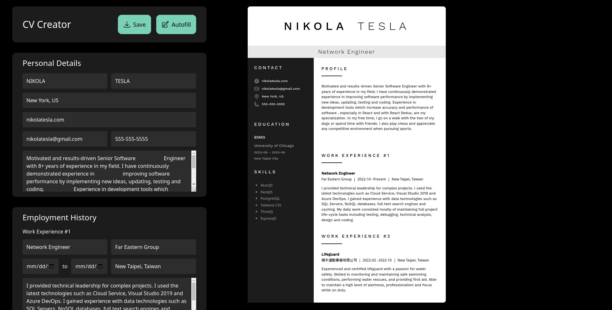

# Cv-Creator

This is the CV project from [The Odin Project](https://www.theodinproject.com/lessons/node-path-javascript-cv-application)  

[Live Demo](https://ascheabl.github.io/cv-project/) 👈  

## Built with  

#### Technologies  

- React  
- Tailwind CSS  
- jsPDF  

## Feature: 
- Autofill Functionality  
- Saves CV as PDF and downloads it  
- Real-time adoption of changes  
- Clean UI/UX  

## Summary  

#### What I learned  

Utilize react contextAPI to solve state management problems, update objects in array with reducer() and remove certain object from the array.

#### Author  

- Github: [aScHEABL](https://github.com/aScHEABL)
